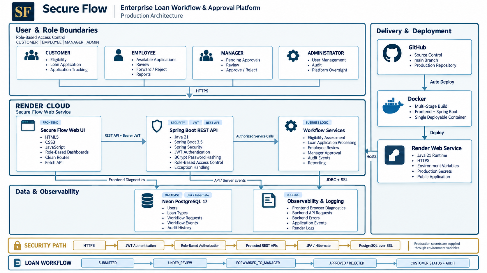
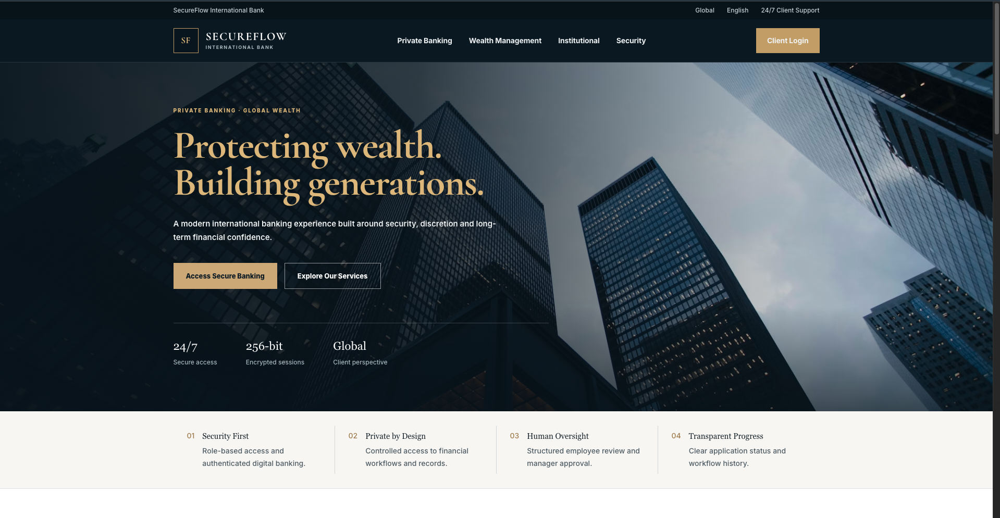
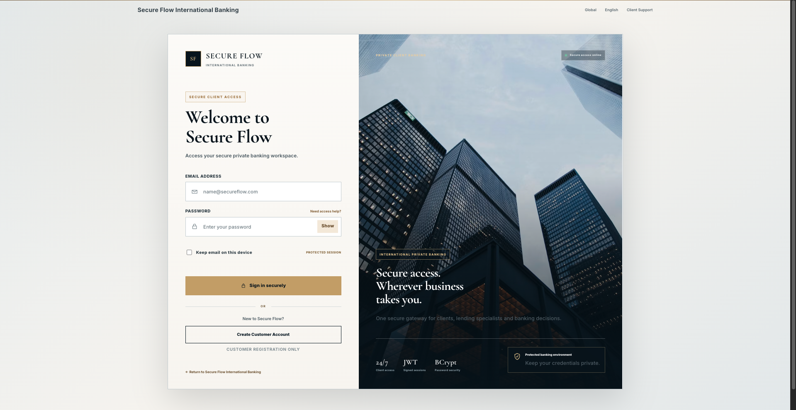
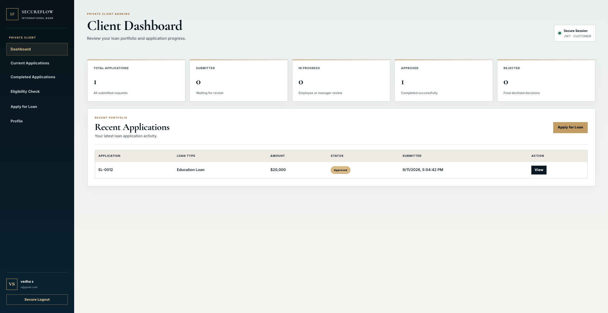
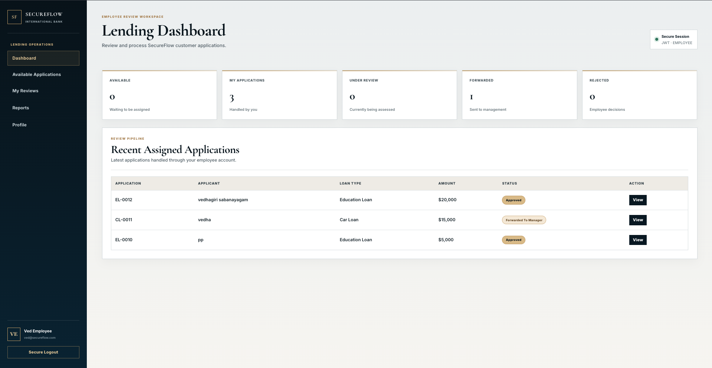
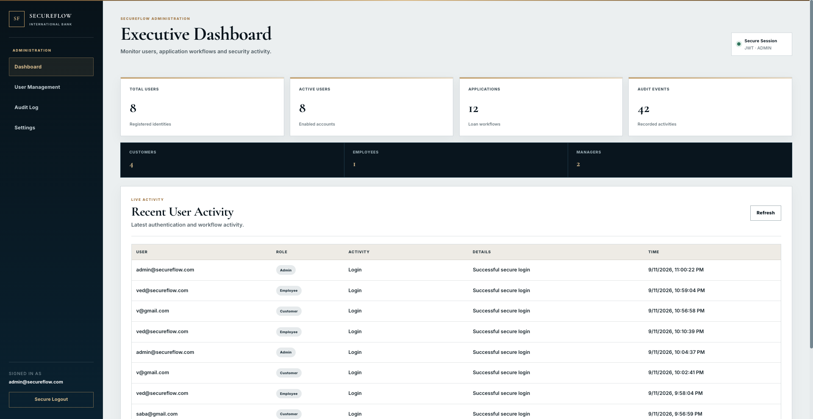
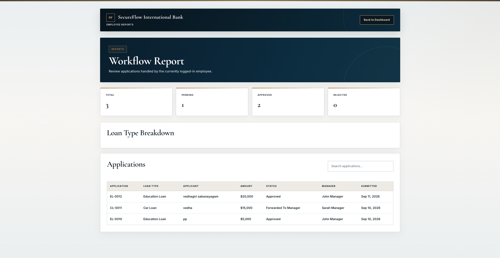
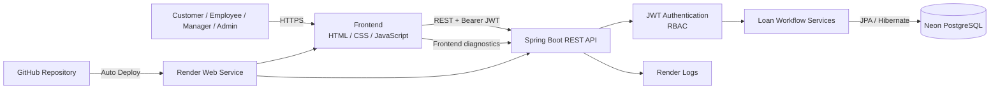

<div align="center">

# Secure Flow

### Enterprise Loan Workflow & Approval Platform

A full-stack, role-based workflow platform that models the complete loan-processing lifecycle from customer eligibility and application submission through employee review, manager decision, audit tracking, reporting, and final customer status.

[](https://secureflow-enterprise.onrender.com)
[](https://www.java.com/)
[](https://spring.io/projects/spring-boot)
[](https://www.postgresql.org/)
[](https://www.docker.com/)

**[Live Application](https://secureflow-enterprise.onrender.com)** ·
**[Source Code](https://github.com/Vedhagiri-20/secureflow-enterprise-platform)**

</div>

---

## Overview

**Secure Flow** is a portfolio-scale enterprise loan workflow application built to demonstrate full-stack software engineering, secure API design, workflow automation, role-based authorization, relational data modeling, observability, containerization, and cloud deployment.

The application models a realistic multi-role financial-services workflow:

```text
Customer
   ↓
Eligibility Assessment
   ↓
Loan Application
   ↓
Employee Review
   ↓
Manager Decision
   ↓
Approved / Rejected
   ↓
Customer Status
   ↓
Audit & Reporting
```

Unlike a static UI demonstration, Secure Flow runs as a deployed application with a Java/Spring Boot backend, PostgreSQL production database, JWT-based authentication, protected role-specific APIs, application logging, and a Docker-based cloud deployment.

> **Live Demo:** https://secureflow-enterprise.onrender.com
>
> The application is hosted on a free cloud instance, so the first request after a period of inactivity may take a short time while the service wakes.

---

## System Architecture

Secure Flow is deployed as a containerized full-stack application with
role-based access enforced by the Spring Boot backend.

<p align="center">
  
</p>

### Production Architecture

The platform combines a role-based Java/Spring Boot application, JWT
authentication, workflow services, managed PostgreSQL storage, centralized
logging, Docker containerization, and cloud deployment through Render.

## Key Features

### Customer Portal

Customers can:

- Create a customer account
- Authenticate securely
- Review available loan products
- Run an eligibility assessment
- Submit a detailed loan application
- Provide identity, employment, income and housing information
- Track submitted applications
- View application details and workflow status
- Follow the application through final approval or rejection

### Employee Workspace

Employees can:

- View available loan applications
- Take ownership of an application
- Review assigned applications
- Start a formal review
- Inspect customer and loan information
- Forward reviewed applications to a manager
- Reject applications when appropriate
- Search workflow records
- Access employee workflow reports

### Manager Workspace

Managers can:

- View applications forwarded for final review
- Inspect complete application details
- Approve eligible applications
- Reject applications
- Track final workflow decisions

### Administrator Workspace

Administrators can:

- View system-level operational information
- Manage application users
- Review user roles
- Monitor platform activity
- Inspect audit events
- Access administrative settings

### Reporting

The employee reporting module provides:

- Assigned workflow totals
- Pending application counts
- Approved application counts
- Rejected application counts
- Loan-type breakdowns
- Searchable workflow history

---

## Workflow Lifecycle

Secure Flow uses explicit workflow states to represent the application lifecycle.

| State | Meaning |
|---|---|
| `SUBMITTED` | Customer submitted a new application |
| `UNDER_REVIEW` | Employee started reviewing the application |
| `FORWARDED_TO_MANAGER` | Employee completed review and escalated it |
| `APPROVED` | Manager approved the application |
| `REJECTED` | Application was rejected |

Typical successful flow:

```text
SUBMITTED
    ↓
UNDER_REVIEW
    ↓
FORWARDED_TO_MANAGER
    ↓
APPROVED
```

The workflow separates customer ownership, employee assignment, and manager approval responsibilities so each role operates within its intended scope.

---

## Role-Based Access Control

Secure Flow defines four primary application roles.

| Role | Main Responsibilities |
|---|---|
| `CUSTOMER` | Eligibility, applications, status tracking |
| `EMPLOYEE` | Application review, assignment, forwarding, reporting |
| `MANAGER` | Final approval and rejection decisions |
| `ADMIN` | User administration, audit visibility and platform oversight |

Authorization is enforced on the backend rather than relying only on frontend navigation.

---

## Security Design

Secure Flow includes multiple application-security controls appropriate for this portfolio deployment.

### Authentication

- Stateless JWT-based authentication
- Tokens are validated by the Spring Security filter chain
- Protected APIs require authenticated requests
- User identity is derived from the authenticated security context

### Password Protection

- Passwords are hashed using BCrypt
- Plaintext passwords are not stored for normal authentication
- Existing passwords cannot be retrieved through the administrator interface

### Authorization

- Role-Based Access Control (RBAC)
- Backend endpoint authorization
- Separate Customer, Employee, Manager and Administrator privileges
- Unauthorized requests return controlled `401` or `403` responses

### Production Secrets

Production configuration is supplied through environment variables rather than embedded into the deployed container.

```text
SECUREFLOW_DB_URL
SECUREFLOW_DB_USERNAME
SECUREFLOW_DB_PASSWORD
SECUREFLOW_JWT_SECRET
SECUREFLOW_JWT_EXPIRATION_MS
```

### Transport Security

- Public application traffic is served over HTTPS
- Production PostgreSQL communication uses SSL
- Database credentials are maintained separately from source code

### Auditability

Workflow activity and operational events can be inspected through application audit functionality and server logging.

> Secure Flow is a portfolio and demonstration application. It is not presented as a regulated banking platform or as compliance-certified financial software.

---

## Observability & Logging

Secure Flow includes separate frontend and backend diagnostic logging.

### Backend Logging

The backend records:

- API access
- HTTP response status
- Request execution duration
- Application warnings
- Server-side errors
- Spring Boot operational events

### Frontend Logging

The browser runtime captures:

- Page access events
- JavaScript errors
- Unhandled promise rejections
- Explicit frontend warnings and errors

Frontend diagnostics are sent to the backend logging endpoint so production issues can be inspected centrally.

### Production Logs

Production logs are available through Render:

```text
Render
└── secureflow-enterprise
    └── Logs
        ├── [BACKEND]
        └── [FRONTEND]
```

### Local Logs

```text
backend/secureflow-api/logs/backend.log
backend/secureflow-api/logs/frontend.log
```

Runtime log files are intentionally excluded from Git.

---

## Application Showcase

### Secure Flow Landing Experience

<p align="center">
  
</p>

### Secure Client Access

<p align="center">
  
</p>

### Customer Dashboard

<p align="center">
  
</p>

### Employee Lending Workspace

<p align="center">
  
</p>

### Administrative Oversight

<p align="center">
  
</p>

### Workflow Reporting

<p align="center">
  
</p>

## Technology Stack

### Frontend

- HTML5
- CSS3
- Vanilla JavaScript
- Responsive layouts
- Fetch API
- Browser token storage
- Clean production routes

### Backend

- Java 21
- Spring Boot 3.5
- Spring Web
- Spring Data JPA
- Spring Security
- Maven
- REST APIs

### Authentication & Security

- JSON Web Tokens (JWT)
- JJWT
- BCrypt password hashing
- Spring Security
- Role-Based Access Control

### Database

- PostgreSQL 17
- Hibernate / JPA
- Neon PostgreSQL for production

### Testing

- JUnit 5
- Spring Boot Test
- Spring Security Test
- Mockito
- Maven test lifecycle

### Deployment

- Docker
- Multi-stage container build
- Eclipse Temurin Java 21
- Render Web Service
- Neon PostgreSQL
- GitHub source integration

---

## Production Architecture



During the Docker build, the frontend is copied into Spring Boot's static resources so one deployed service serves both the browser application and backend APIs.

---

## Live Environment

| Component | Platform |
|---|---|
| Application | Render |
| Database | Neon PostgreSQL |
| Source Control | GitHub |
| Container | Docker |
| Runtime | Eclipse Temurin Java 21 |
| Public Transport | HTTPS |
| Database Transport | PostgreSQL + SSL |

---

## Application Routes

Production uses short browser-friendly routes.

```text
/
├── /login
├── /register
├── /client
├── /employee
├── /manager
├── /admin
├── /eligibility
├── /apply
├── /application
└── /reports
```

The original frontend HTML structure remains internally organized by feature while public navigation uses cleaner URLs.

---

## API Design

The backend follows a layered Spring Boot design.

```text
Controller
    ↓
Service
    ↓
Repository
    ↓
PostgreSQL
```

Representative API areas include:

```text
/api/auth/**
/api/customer/**
/api/eligibility/**
/api/employee/**
/api/manager/**
/api/admin/**
/api/reports/**
/api/workflows/**
/api/logs/**
```

Role-specific endpoints are protected by Spring Security.

---

## Repository Structure

```text
secureflow-enterprise-platform/
│
├── backend/
│   └── secureflow-api/
│       ├── src/
│       │   ├── main/
│       │   │   ├── java/com/secureflow/
│       │   │   │   ├── config/
│       │   │   │   ├── controller/
│       │   │   │   ├── dto/
│       │   │   │   ├── entity/
│       │   │   │   ├── exception/
│       │   │   │   ├── logging/
│       │   │   │   ├── repository/
│       │   │   │   ├── security/
│       │   │   │   └── service/
│       │   │   └── resources/
│       │   └── test/
│       ├── pom.xml
│       └── mvnw
│
├── frontend/
│   ├── assets/
│   ├── auth/
│   ├── customer/
│   ├── dashboard/
│   ├── notification/
│   ├── report/
│   └── workflow/
│
├── database/
├── deployment/
├── doc/
├── project-management/
├── security/
├── Dockerfile
├── .dockerignore
├── .env.example
├── .gitignore
└── README.md
```

---

## Local Development

### Prerequisites

Install:

- Java 21+
- PostgreSQL
- Python 3 or another local static-file server
- Git

### Clone the repository

```bash
git clone https://github.com/Vedhagiri-20/secureflow-enterprise-platform.git
cd secureflow-enterprise-platform
```

### Configure local environment

```bash
export SECUREFLOW_DB_URL="jdbc:postgresql://localhost:5432/secureflow_db"
export SECUREFLOW_DB_USERNAME="postgres"
export SECUREFLOW_DB_PASSWORD="YOUR_LOCAL_PASSWORD"
export SECUREFLOW_JWT_SECRET="YOUR_BASE64_JWT_SECRET"
export SECUREFLOW_JWT_EXPIRATION_MS="28800000"
```

Generate a development JWT secret with:

```bash
openssl rand -base64 64 | tr -d '\n'
echo
```

Never commit production credentials.

### Start the backend

```bash
cd backend/secureflow-api
./mvnw spring-boot:run
```

Backend:

```text
http://localhost:8080
```

### Start the frontend

From the repository root:

```bash
python3 -m http.server 5500 --bind 127.0.0.1 --directory frontend
```

Frontend:

```text
http://127.0.0.1:5500
```

---

## Testing

Run the backend test suite:

```bash
cd backend/secureflow-api
./mvnw test
```

The current suite covers:

- Spring application context
- Authentication service behavior
- JWT functionality
- Eligibility service logic

JavaScript syntax can be checked with Node.js:

```bash
find frontend -type f -name "*.js" -print0 |
while IFS= read -r -d '' file
do
    node --check "$file"
done
```

---

## Engineering Highlights

This project demonstrates practical experience with:

- Full-stack application development
- Java and Spring Boot
- RESTful service design
- Authentication and authorization
- JWT security
- BCrypt password hashing
- Role-Based Access Control
- Relational database design
- PostgreSQL and JPA
- Multi-stage business workflows
- Audit-event tracking
- Frontend and backend observability
- Docker containerization
- Cloud application deployment
- Managed PostgreSQL infrastructure
- Production environment configuration
- Git-based deployment workflows

---

## Current Status

### Version 1

The primary Secure Flow workflow is complete and deployed.

- [x] Customer registration
- [x] Customer authentication
- [x] JWT security
- [x] BCrypt password hashing
- [x] Role-Based Access Control
- [x] Eligibility assessment
- [x] Loan application submission
- [x] Customer workflow tracking
- [x] Employee review workflow
- [x] Manager approval workflow
- [x] Administrator dashboard
- [x] Audit activity
- [x] Employee reporting
- [x] Frontend error logging
- [x] Backend request/error logging
- [x] Clean production URLs
- [x] Docker deployment
- [x] Managed PostgreSQL production database
- [x] Public cloud deployment

---

## Future Enhancements

Potential future versions could include:

- Password reset workflow
- Multi-factor authentication
- Email or SMS notifications
- Document upload and secure object storage
- Rate limiting
- Account lockout policies
- Refresh-token rotation
- Expanded integration testing
- Database migration tooling
- CI quality gates
- Advanced reporting dashboards
- Custom domain deployment

These are future enhancements rather than requirements for the current portfolio release.

---

## Demo & Data Notice

Secure Flow is an educational and portfolio demonstration platform.

Do not submit:

- Real Social Security numbers
- Real government identification
- Real banking credentials
- Real financial account information
- Production passwords
- Other sensitive personal information

Use fictional or dummy data when testing the public application.

---

## Author

Developed by **Vedhagiri-20**

GitHub: https://github.com/Vedhagiri-20

---

<div align="center">

### Secure Flow

**Enterprise workflow engineering from application to production.**

[Launch Secure Flow](https://secureflow-enterprise.onrender.com)

</div>
